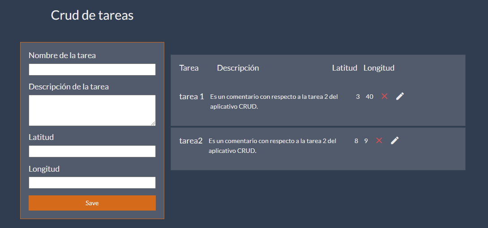
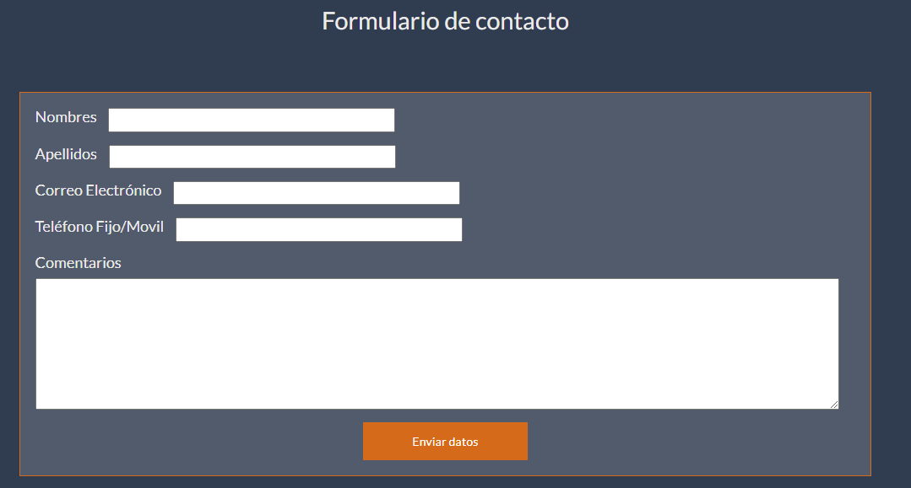
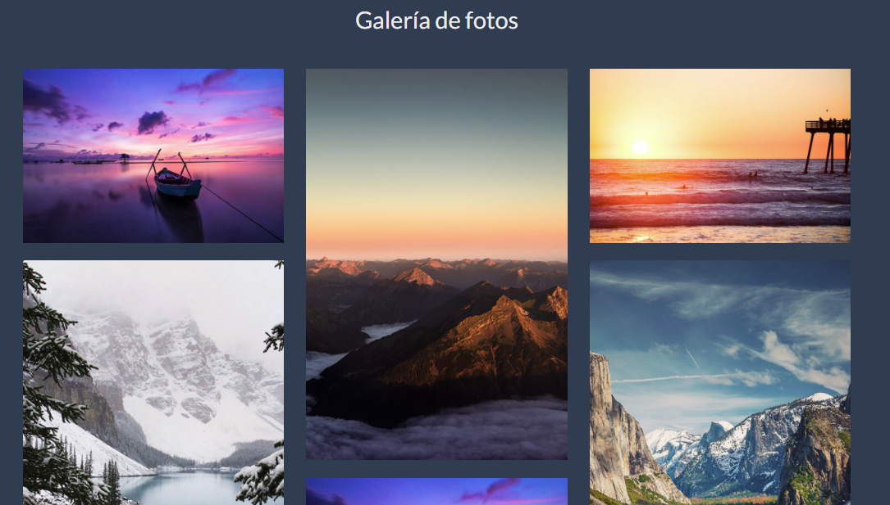

Este Proyecto fue realizado con React, bootstrap y firebase 9

Este es el CRUD de tarears

Este es el formulario

Este es la galeria de imágenes

## Ejecutar el proyecto

Descargar el proyecto

Primero ejecutar el comando
### `npm install`

Primero ejecutar el comando
### `npm run start`
